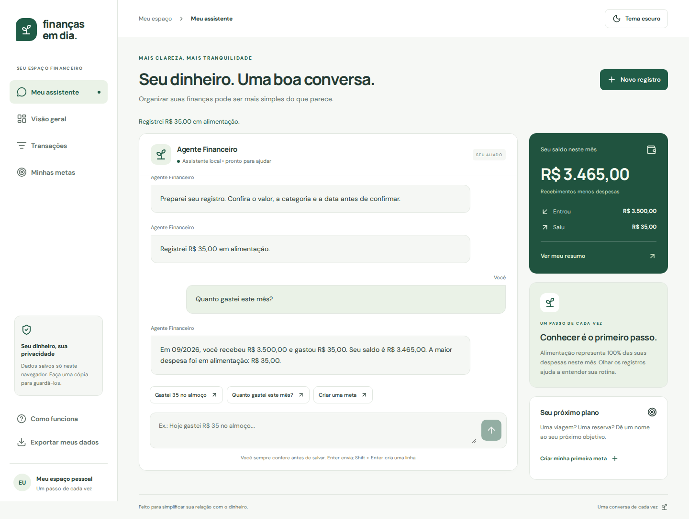
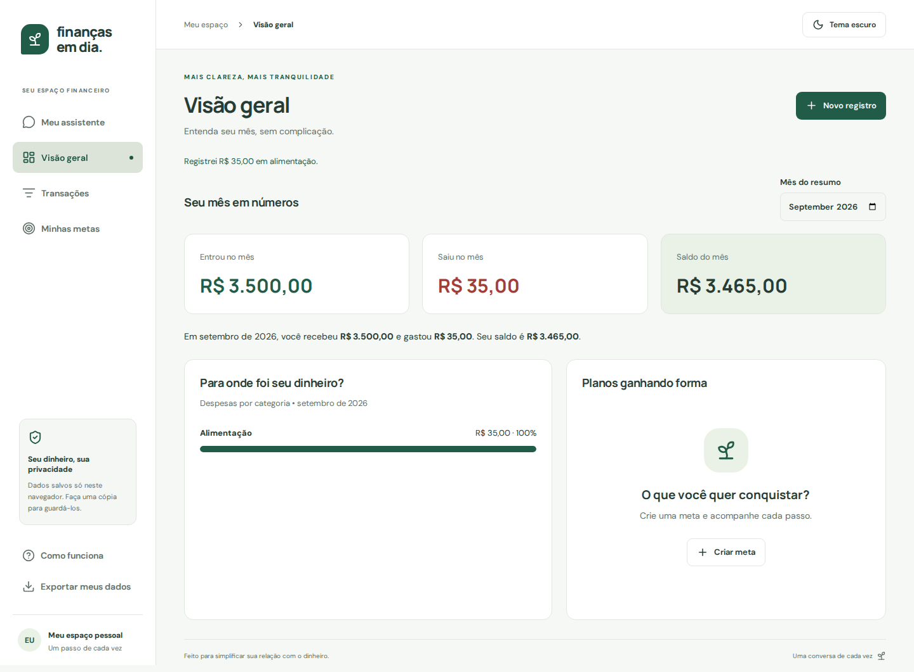
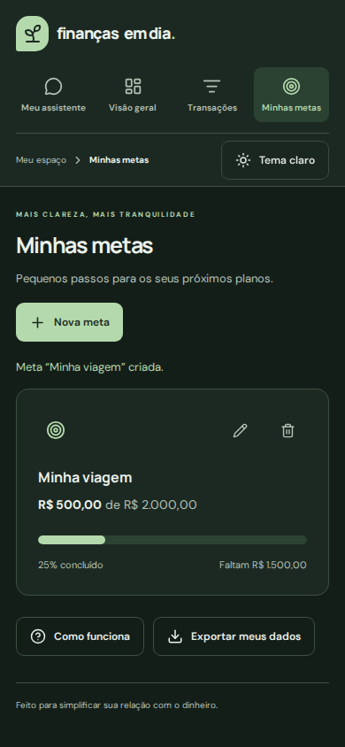

# Finanças em Dia

Aplicativo web de finanças pessoais baseado no PRD: organize receitas, despesas e metas por uma conversa ou por formulários simples. Interface em português, responsiva, com temas claro e escuro.

## Antes de entregar: veja e teste

Execute o app conforme as instruções abaixo e abra <http://localhost:5173>. O [roteiro de teste manual](docs/TESTE-MANUAL.md) contém exemplos e resultados esperados para validar receitas, despesas, saldo, metas, edição, exclusão, acessibilidade e temas.

## Entrega do desafio DIO

**Estado da entrega:** projeto implementado e testes automatizados executados. A revisão pessoal do autor, os prints da conversa de desenvolvimento com a IA e a reflexão final ainda precisam ser concluídos antes do envio à DIO.

### Resumo do aplicativo

O Finanças em Dia ajuda iniciantes a registrar o que receberam e gastaram, entender o saldo do mês e acompanhar metas. A conversa prepara os registros para confirmação; formulários oferecem outra maneira de fazer a mesma tarefa. O usuário pode corrigir dados, desfazer a última exclusão e alternar entre os temas claro e escuro. Nesta primeira versão, tudo é armazenado no navegador.

### Prompt final — PRD consolidado para reprodução

O texto abaixo consolida o PRD, o complemento de Design Universal e as decisões desta primeira versão. É uma organização posterior dos requisitos, e não uma transcrição literal de uma única mensagem enviada à IA. Consulte também o [PRD original completo](docs/PRD.md) e o [complemento de acessibilidade](docs/ACESSIBILIDADE.md).

> Crie do zero um aplicativo web responsivo de finanças pessoais chamado Finanças em Dia, em português brasileiro, para pessoas que estão começando a organizar o próprio dinheiro. Priorize clareza, linguagem simples e uma experiência conversacional.
>
> O fluxo principal deve ser: conversar → interpretar → conferir e confirmar → salvar → atualizar histórico e resumo → acompanhar metas. Ofereça também registro manual, sem depender exclusivamente da conversa.
>
> Implemente uma apresentação inicial, chat com histórico e sugestões, tela de transações, visão geral mensal e metas financeiras. Permita registrar receitas e despesas, identificando tipo, valor, descrição, categoria, data e origem. Categorias iniciais: alimentação, transporte, moradia, saúde, lazer, educação, compras, salário e outros. Use reais e valores em centavos para os cálculos.
>
> Exemplos de interação: “Gastei 35 no almoço”, “Recebi 3.500 de salário”, “Quanto gastei este mês?” e “Quero guardar 2.000 para uma viagem”. Informações ausentes ou ambíguas devem gerar um pedido de esclarecimento. Antes de salvar, permita confirmar, corrigir ou cancelar; depois, permita editar e excluir. Ofereça recuperação da última exclusão.
>
> O histórico deve permitir filtros por período e categoria. O resumo deve mostrar receitas, despesas, saldo, maior categoria de gasto e distribuição das despesas com valores em texto. As metas devem ter nome, valor desejado, valor reservado, prazo opcional e progresso. As observações do assistente devem ser educativas, baseadas nos dados e sem promessas de resultado financeiro.
>
> Aplique Design Universal em uma única experiência: navegação consistente, linguagem acessível, campos rotulados, estrutura semântica, contraste, foco visível, teclado, compatibilidade com leitores de tela, áreas de toque confortáveis, mensagens de erro explicativas e feedback após ações. Não dependa apenas de cores ou animações. Inclua um botão claro/escuro e lembre a preferência. Adapte a interface para celular, tablet e desktop.
>
> Para o protótipo inicial, implemente interpretação local de frases e armazenamento no navegador, explicitando que não há IA generativa integrada, conta ou sincronização. Não inclua integração bancária, pagamentos, investimentos, importação de extratos, múltiplas moedas ou compartilhamento de contas.
>
> Teste regras financeiras e os fluxos no navegador, incluindo acessibilidade nos dois temas e tamanhos de tela. Documente a execução e os limites reais. Crie um repositório GitHub e envie o código validado, sem segredos. Mantenha evidências reais do processo e da aplicação.

### Capturas reais do aplicativo

Dados fictícios, gerados em uma sessão de teste isolada. Estas são interações com o **assistente local do app**, não com um modelo generativo.

**Conversa, confirmação dos registros e consulta do mês**



**Resumo financeiro atualizado a partir dos registros**



**Meta e tema escuro em tela de celular**



### Evidências das interações com a IA de desenvolvimento

O projeto foi construído com auxílio de IA a partir do PRD fornecido pelo autor. Nesta conversa de desenvolvimento, o autor solicitou acessibilidade, botão claro/escuro, criação do projeto do zero, publicação no GitHub e alteração da visibilidade para pública. A implementação passou por correções orientadas pelos testes antes do push.

**Pendente antes da entrega:** acrescentar prints reais desta conversa de desenvolvimento. As capturas do app acima não substituem essa evidência. Veja [como selecionar os trechos](docs/TESTE-MANUAL.md#evidências-para-a-dio). Nenhuma captura da conversa de desenvolvimento foi inventada ou simulada.

### Reflexão sobre o processo — rascunho para revisão do autor

**O que funcionou bem?** O PRD com exemplos de frases e critérios de sucesso tornou as tarefas concretas. A inclusão explícita de acessibilidade e tema claro/escuro levou esses requisitos para a implementação desde a base. Os testes ajudaram a conferir valores, persistência e ações de confirmação, edição e cancelamento.

**O que não funcionou como o esperado?** A validação encontrou problemas no foco inicial dos formulários e no resumo após limpar filtros; ambos foram corrigidos. O ambiente de testes também precisou de bibliotecas adicionais para executar o navegador. O resultado ainda tem limites: o assistente interpreta regras locais e não compreende linguagem livre como um modelo generativo; os dados não sincronizam entre dispositivos.

**O que o processo ensinou sobre conversar com IAs?** Exemplos concretos, limites de escopo e resultados esperados ajudam a transformar uma ideia em requisitos verificáveis. Pedir evidências de teste e distinguir uma funcionalidade implementada de uma proposta evita assumir que tudo está pronto. Revisar e testar as respostas continua sendo parte do trabalho do autor.

Iniciei o projeto usando o **Lovable**, mas os creditos acabaram com apenas um prompt e o projeto não foi terminado. Utilizei o mesmo prompt e usei o **CODEX** para executar o projeto final.

Este rascunho descreve fatos observados na construção; o autor deve acrescentar sua própria experiência após testar o app. Não representa uma avaliação pessoal já realizada nem garante aprovação pela DIO.

## Executar

Requer Node.js 22.12+ (recomendado: 24) e npm.

```bash
npm ci
npm run dev
```

Abra o endereço mostrado no terminal. Para gerar a versão de produção: `npm run build`. Para visualizar esse build: `npm run preview`. A pasta `dist/` pode ser hospedada em um servidor estático HTTPS.

## Implementado

- Onboarding e chat principal com histórico local.
- Interpretação local de receitas, despesas, categorias, metas e consultas mensais.
- Confirmação/edição de todo lançamento antes de salvar.
- Registro manual; edição; exclusão com confirmação e opção de desfazer.
- Histórico com filtros por mês, categoria e descrição.
- Resumo mensal, receitas, despesas, saldo e distribuição por categoria.
- Metas com valor desejado, reserva, prazo opcional e progresso; edição e exclusão.
- Observações educativas calculadas a partir dos registros.
- Persistência no navegador, exportação JSON e tratamento de falha de armazenamento.
- Tema claro/escuro persistente; preferência inicial do sistema operacional.

## Escopo desta primeira versão

O assistente **usa regras locais**, e não IA generativa. Não há chamadas a modelos, custos de API, backend, autenticação, conta compartilhada ou sincronização entre dispositivos. É um protótipo funcional para validar o fluxo do PRD com usuários. A integração a um modelo de IA e armazenamento por usuário é uma próxima etapa de produto, não uma capacidade já entregue.

Dados financeiros ficam no `localStorage` deste navegador e origem. Não há criptografia de aplicação. Limpar o armazenamento ou usar outro navegador não preserva os registros; exporte cópias JSON. A interface ainda não importa essas cópias. Se houver dados inválidos, o app evita sobrescrevê-los. Metas são acompanhamento manual e não movimentam saldo. Registros aceitam datas até hoje e valores positivos até R$ 1 bilhão. O chat mantém as últimas 200 mensagens.

Valores monetários são inteiros em centavos; entradas seguem formato brasileiro (`1.234,56`). O chat aceita hoje, ontem ou data `DD/MM/AAAA`; referências ambíguas pedem esclarecimento. Registre um valor por mensagem. Consultas aceitam este mês e mês passado. Transações de outros períodos podem ser filtradas na tela própria.

## Exemplos

- `Gastei R$ 35,50 no almoço`
- `Recebi meu salário de 3.500`
- `Gastei 80 de Uber em 25/09/2026`
- `Quanto gastei com alimentação este mês?`
- `Quanto gastei mês passado?`
- `Quero guardar 2.000 para uma viagem`
- `Quanto falta para minhas metas?`

## Acessibilidade e Design Universal

Ver [requisitos de acessibilidade](docs/ACESSIBILIDADE.md). Estrutura HTML semântica, controles rotulados, foco visível, link para pular navegação, estados anunciados, confirmações nativas com `<dialog>`, Escape, retorno de foco, textos junto às cores, áreas de toque, respeito à redução de movimento e layout móvel. Os gráficos têm valores e categorias em texto.

Referências: [W3C: diálogos](https://www.w3.org/WAI/ARIA/apg/patterns/dialog-modal/) e [W3C: HTML dialog](https://www.w3.org/WAI/WCAG22/Techniques/html/H102). Testes automáticos ajudam a detectar falhas, mas não certificam conformidade integral WCAG. É necessário validar manualmente com leitores de tela e usuários reais.

## Validação

```bash
npm run build
npm test
npx playwright install chromium
npm run test:e2e
```

Testes unitários cobrem centavos, valores inválidos, datas, ambiguidades, categorias, metas e resumos. Playwright cobre CRUD de transações, restauração, persistência, metas, cancelamento, teclado, tema e auditoria axe em quatro telas, dois temas e duas larguras. A CI repete os comandos no GitHub.

## Estrutura

- `src/finance.ts`: tipos, regras financeiras, interpretação e validação do armazenamento.
- `src/App.tsx`: telas, formulários, persistência e ações.
- `src/styles.css`: design responsivo e temas.
- `src/finance.test.ts`, `tests/app.spec.ts`: testes unitários e de navegador.
- `docs/PRD.md`: PRD original fornecido pelo usuário.
- `docs/ACESSIBILIDADE.md`: complemento de Design Universal e roteiro de validação.

Não há integração bancária, pagamentos ou recomendações de investimento. O assistente apresenta informações educativas sobre os dados registrados.
